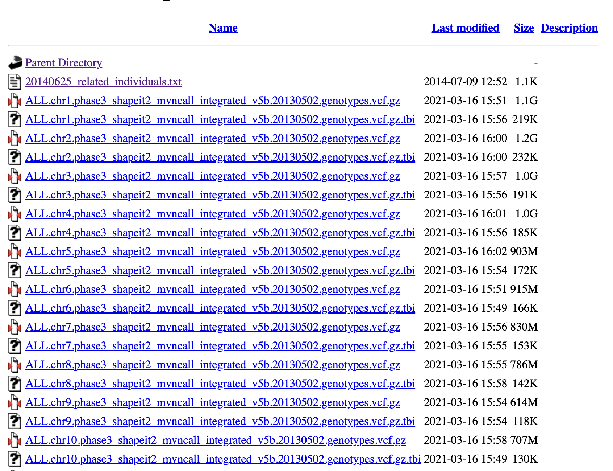
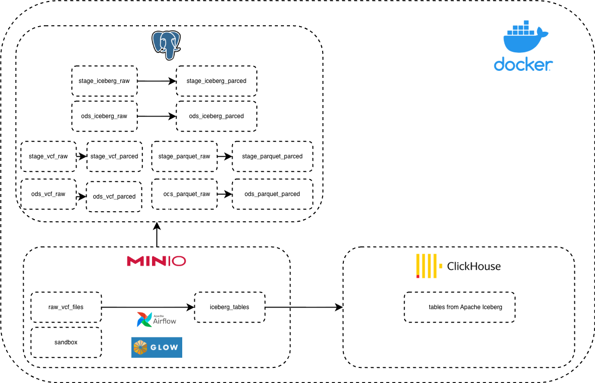
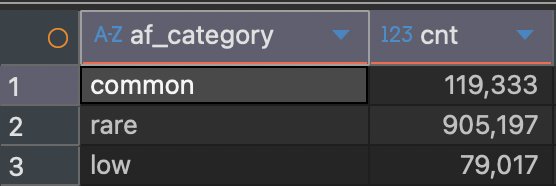

# BioWareHouse
Разработка хранилища данных для решения задач биоинформатики

## Постановка задачи
Биоинформатика является одной из научных сфер, которая богата данными: последовательности аминокислот, 
полученные в результате секвенирования; информация о выравнивании последовательностей, варианты и генотипы различных образцов и и т.д. 
Часто идет речь о работе с большим объемом данных, в результате чего требуется использование современных подходов по управлению такими данными, их организации; реализации удобного и быстрого поиска по данным,
проектировании различных ETL-процессов для обработки сырых данных, а также их визуализация. В рамках данной работы рассматривается:
 - Реализация хранилища данных для сущностей, описывающие варианты - информации о изменении в некотором геноме по сравнению с референсным геномом, которое содержит компоненты для холодного хранения данных, аналитической СУБД, а также СУБД для хранения метаданных;
 - Подход для перевода классических архивированных VCF-файлов в parquet-формат для работы с такими данными из аналитической СУБД (в перспективе - перевод в iceberg-формат); оценка преимуществ и недостатков такого решения;
 - Организация ETL-процессов по трансформированию и обработке данных. 
### Обзор существующих решений
Существующие решения, позволяющие организовать data lake для решения задач биоинформатики, часто не представляют из себя
open-source решения (например, AWS); а инструменты для обработки данных о вариантах часто представляют классические для биоинформатиков решения - например, bcftools. Решение, описанное в данной работе, рассматривает возможность
построение хранилища данных с использованием инструментов с открытым исходным кодом, а также возможностью использования более знакомого инструмента аналитикам для работы с данными о вариантах - SQL (ClickHouse).

### Объект исследования
Строить хранилище данных (DataWareHouse, далее - DWH) будем на данных c ресурса "1000 genomes" (https://www.internationalgenome.org/),
а именно на информации о вариантах по некоторым популяциям; файлы разбиты по хромосоме. Формат файлов - vcf.gz; на портале к каждому из файлов прилагается файл, представляющий собой индекс для быстрого поиска; формат такого файла - vcf.gz.


## Архитектура хранилища и используемые технологии
Архитектура хранилища предполагает наличие:
 - S3 - хранилища для "холодного" хранения сырых и обработанных данных; инструмент - Minio
 - Аналитической СУБД для манипулирования и агрегации данных, а также создания таблиц/вью для сохранения пользовательских результатов; инструмент - ClickHouse
 - СУБД для хранения информации о расположении файлов и данных в системе для осуществления удобного поиска со стороны пользователей; инструмент - Postgres Pro
 - Оркестратор задач для реализации ETL-процессов; инструмент - Airflow
   
## Структура репозитория
 - infrastructure/docker-compose.yml - Docker-файл для конфигурации, первоначальной инициализации и развертывания хранилища локально. Компоненты не только разворачиваются отдельно, но и связываются между собой - например, определяются таблицы для записи данных из Minio в ClickHouse
 - postgres_init/init_meta_tables.sql - скрипт для первоначальной инициализации таблиц и вью в Postgres
 - airflow/dags - папка с дагами Airflow. На данный момент реализован даг, разбивающий исходный файл по батчам с конвертацией в parquet и загрузкой в Minio

## Анализ результатов
Разбиение на батчи данных и загрузка в Minio позволяет читать данные из ClickHouse и обрабатывать данные в терминах аналитической СУБД
Пример одного из возможных запросов (на примере единого parquet-файла):
```sql
SELECT *
FROM s3('http://minio:9000/parquet-files/all_chr22_phase3.parquet',
 'access_key',
 'secret_key',
 'Parquet');
```
Результат (вывод таблицы также содержит колонки-образцы с информацией по генотипам):


Еще один вариант запроса:
```sql
SELECT case
	when toFloat32OrNull(extract(INFO, 'AF=([^;]+)')) < 0.01 THEN 'rare'
        WHEN toFloat32OrNull(extract(INFO, 'AF=([^;]+)')) < 0.05 THEN 'low'
        ELSE 'common'
    END AS af_category,
    count() AS cnt
FROM  s3('http://minio:9000/parquet-files/all_chr22_phase3.parquet',
 'access_key',
 'secret_key',
 'Parquet')
WHERE `#CHROM` = '22'
GROUP BY af_category;
```
Результат:



